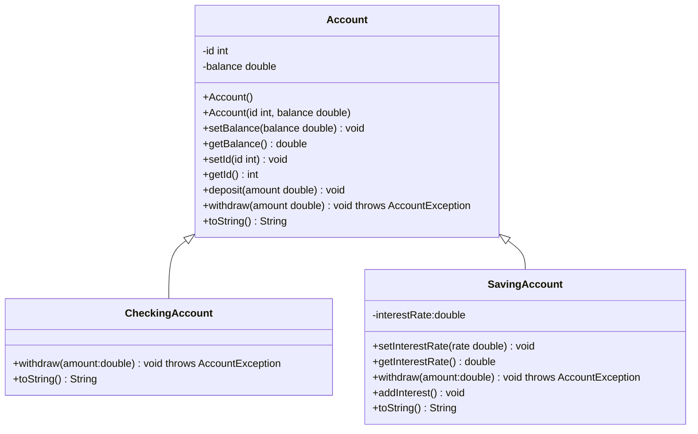

```mermaid
classDiagram
    Account <|-- CheckingAccount
    Account <|-- SavingAccount
    Account: -id int
    Account: -balance double
    Account: +Account()
    Account: +Account(id int, balance double)
    Account: +setBalance(balance double)void
    Account: +getBalance()double
    Account: +setId(id int)void
    Account: +getId()int
    Account: +deposit(amount double)void
    Account: +withdraw(amount double)void throws AccountException
    Account: +toString()String
    class CheckingAccount{
        +withdraw(amount:double)void throws AccountException
        +toString()String
    }
    class SavingAccount{
        -interestRate:double
        +setInterestRate(rate double)void
        +getInterestRate()double
        +withdraw(amount:double)void throws AccountException
        +addInterest()void
        +toString()String
    }
```