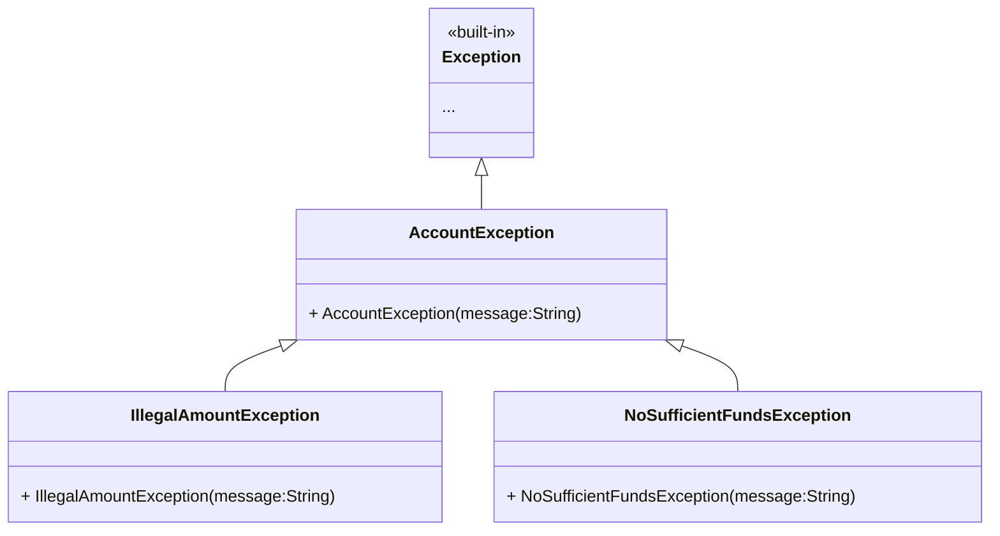

```mermaid
classDiagram
    Exception <|-- AccountException
    AccountException <|-- IllegalAmountException
    AccountException <|-- NoSufficientFundsException
    Exception: ...
    class Exception {
        <<built-in>>
    }
    class AccountException{
        + AccountException(message:String)
    }
    class IllegalAmountException{
        + IllegalAmountException(message:String)
    }
    class NoSufficientFundsException{
        + NoSufficientFundsException(message:String)
    }
```