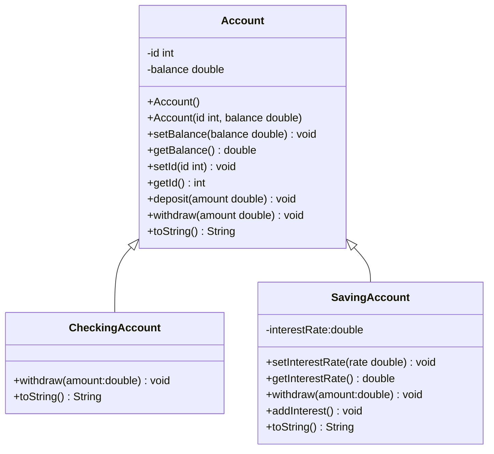

# Project Twelve Exception Handle

**Purpose:** The purpose for this project is to reinforce the knowledge learned in 
Chapter 12.

## Objectives:
1. Write your own exception classes.
2. Apply exception handling in program.

## Problem description:
**Modify** bank Account family classes from Project Eleven. You may modify the 
following class diagram if it is needed. This time, handle exceptions in bank 
business. **Two new class shall be added: IllegalAmountException and 
NoSufficientFundsException. You may add the class diagram by yourself to 
help you understand.**

## Requirement:
The class design could be better. However, we are limited with the knowledge we 
have now. So the above class diagram is reasonable. All methods are explained by 
their names. Please pay attention to withdraw and deposit methods. 
The Account class withdraw method is implemented by doing nothing. The 
CheckingAccount withdraw method must fulfill the policy that the withdraw amount 
must greater than 0 and less than or equal to current account balance. The 
SavingsAccount withdraw method must fulfill the policy that the minimum balance 
of the account must be 500 all the time. Also the withdraw amount must greater 
than 0. **If the condition cannot be fulfilled, withdraw method will throw 
corresponding exceptions.**

**The deposit methods also need to make sure that the amount to deposit is 
positive. If not, the method will throw IllegalAmountException**

When addInterest method in SavingsAccount class, the account balance updated to 
current_balance * (1 + interestRate) where interestRate is in decimal form. For 
instane, 6% is 0.06.

The students must write a main function to test these accounts. In main function, 
polymorphism must be used to handle a collection of accounts.

### Sample pseudo code for main function 
1. Declare an array of Account, named accounts, of size 4 
2. Initialize every element in accounts array.  Make accounts[0] and accounts[1] 
be CheckingAccount and accounts[2] and accounts[3] be SavingsAccount 
3. Make deposit and withdraw for each account and print out the account 
information to see the result. **Note: You may use Exception Handling here. 
Put those code in try block and write corresponding catch blocks** 
4. If the account is SavingsAccount, call addInterest function to update the 
account balance. Then print out the account information 

## Submission:
Submit the YourProj12.java file via blackboard link. The due date will be announce 
on blackboard 